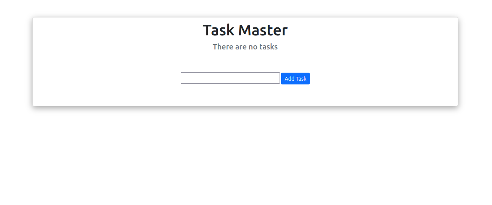
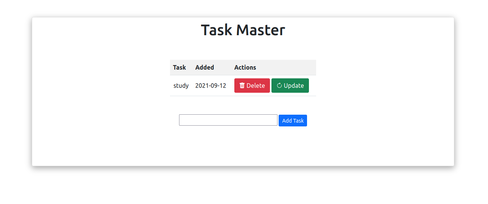
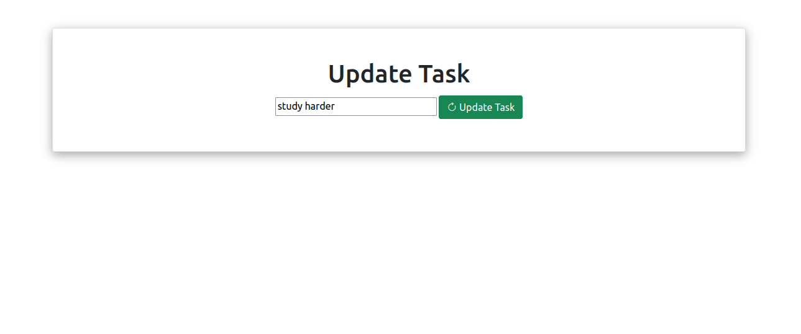

# Task Master

### :muscle: Motivation

As a self-taught and to learn more about how to create and deploy a Flask app I decided to create a simple application to save tasks wich can be updated or deleted.

### :cd: Prerequisites

- [Python3](https://www.python.org/downloads/)

### :minidisc: Instalation

1. Clone the project `git clone https://github.com/victormacedo996/task-master`
1. Enter the project folder `cd task-master`
1. Intall the requirements `pip3 install -r requirements.txt`

### :electric_plug: Runing the project

Once inside the project folder, run the comand `python3 app.py`. It will start a local server at port 5000.

### :computer: Technologies used

- [Python3](https://www.python.org/)
- [Flask](https://flask.palletsprojects.com/en/2.0.x/)
- [Jinja2](https://jinja.palletsprojects.com/en/3.0.x/)
- [Bootstrap5.1](https://getbootstrap.com/)

### :camera_flash: Screenshots

Home page

Adding a new task

Updating a task

### :gear: Optimization

Since I'am still learning how to use Flask microframework, the will be refactored to use [application factory](https://flask.palletsprojects.com/en/2.0.x/patterns/appfactories/) design parttern to be as scalable as possible.

### :rocket: Author

- [Victor Macedo](https://github.com/victormacedo996/)